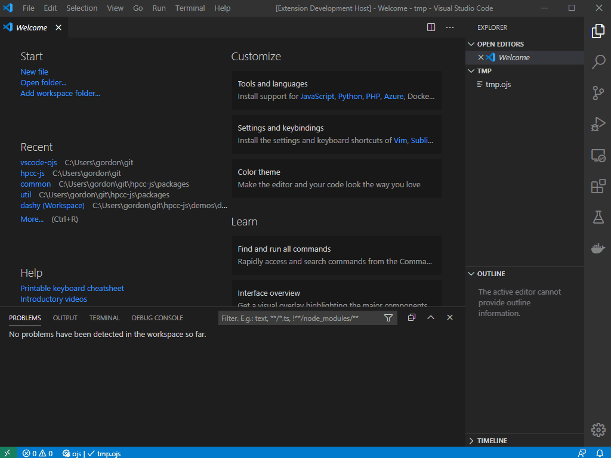

# Observable JavaScript | Markdown


VS Code extension for Observable "JavaScript" and "Markdown".  This extension would not have been possible without the following:
* [ObservableHQ/parser](https://github.com/observablehq/parser)
* [ObservableHQ/runtime](https://github.com/observablehq/runtime)
* [@hpcc-js/observable-md](https://github.com/hpcc-systems/Visualization/tree/master/packages/observable-md)



## Quick Start with Observable JavaScript | Markdown

1. Create a new file with either the `.ojs` or `.omd` extension.
2. Select "OJS: Import Notebook" from command palette.
3. Enter `https://observablehq.com/@observablehq/a-taste-of-observable` for the import URL.
4. Press `Ctrl+K V` to preview notebook.
5. Select "OJS: Export to HTML" from the command palette .
6. Double click the exported HTML file to view in browser.

## Commands
_All commands are prefixed with "OJS" and are available via the command palette or by default shortcut key mappings_

| Command                   | Shortcut | Description                                                      |
|---------------------------|:--------:|------------------------------------------------------------------|
|OJS: Check Syntax          |F7        | Syntax Check                                                     |
|OJS: Preview Web Page      |Ctrl+K V  | Preview notebook in an embedded Web Page                         |
|OJS: Import Notebook       |          | Import published or shared notebook cells into current document  |
|OJS: Export to HTML        |          | Export as a self contained HTML file                             |

## Settings
_All settings are prefixed with "ojs." and are available via `file -> preferneces -> settings` menu_

| Setting                   | Default | Description                                               |
|---------------------------|:-------:|-----------------------------------------------------------|
| ojs.refreshPreviewOnSave  | true    | Refresh preview (if visible) when OJS document is saved   |
| ojs.showRuntimeValues	    | false   | Show runtime values as diagnostic info                    |

## Sample OJS File (myfile.ojs)

```javascript
md`# Generator Test`;

function* range(n) {
  for (let i = 0; i < n; ++i) {
    yield i;
  }
}

{
  for (const i of range(Infinity)) {
    yield Promises.tick(1000, i + 1);
  }
}

md`# Import Test`;

import {viewof selection as cars} from "@d3/brushable-scatterplot";
viewof cars;

md`### Selection:
~~~json
${JSON.stringify(cars, undefined, 2)}
~~~
`;
```

## Sample OMD File (myfile.omd)

``````markdown
# Generator Test
_Simple Generator test_

```
function* range(n) {
  for (let i = 0; i < n; ++i) {
    yield i;
  }
}

{
  for (const i of range(Infinity)) {
    yield Promises.tick(1000, i + 1);
  }
}
```

# Import Test
_Simple Import Test_

```
import {viewof selection as cars} from "@d3/brushable-scatterplot";
viewof cars;
```

### Selection:

```json 
${JSON.stringify(cars, undefined, 2)}
```
 
``````
